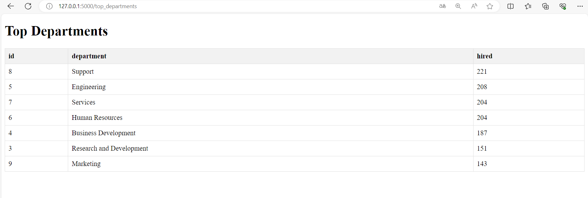
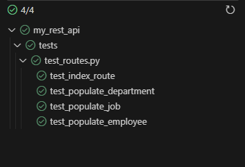
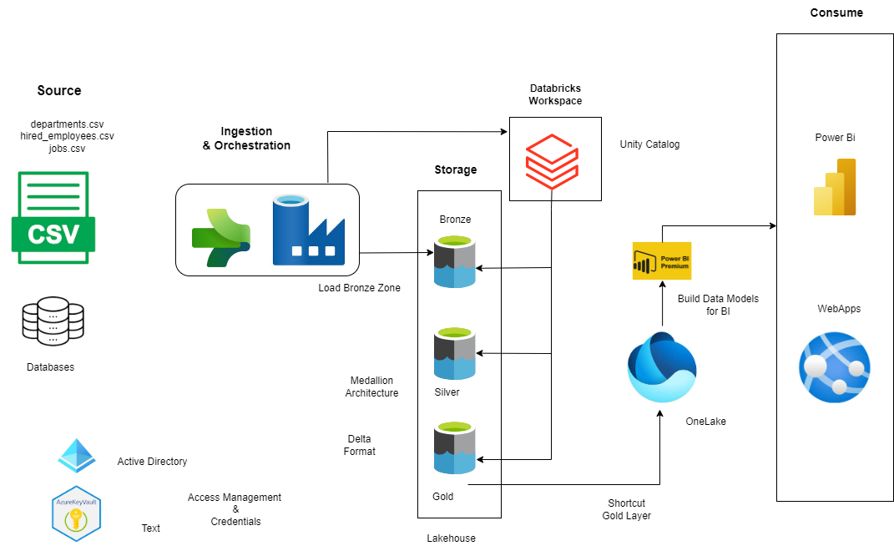

# Data_Challenge_API

# Project: Flask Application for DB Migration and Data Exploration

## Section 1: API

DB migration of three tables: Departments, Jobs, Employees

1. **Receive Historical Data from CSV Files**: The API accepts CSV files containing historical data for departments, jobs, and employees:
     the endpoint /api/populate_table expects a payload, with the path of the csv file to be loaded, the schema, and the name of table. To do it more generic. Example:
     **Payload to load CSV Files**
     **{
    "csv_file_path": "app/data/hired_employees.csv",
    "schema": {
        "column_mapping": {
            "id": 0,
            "name": 1,
            "datetime": 2,
            "department_id": 3,
            "job_id": 4
        }
    },
    "table_name": "Employee"
}**

2. **Upload Files to the New DB**: The API processes and uploads the CSV files into the  SQL database. the function **upload_data** was built for this purpose

### Clarifications:

- For facility the CSV files are located in the /data folder of the app
- The chosen database is sqllite

## Section 2: SQL

To explore the data inserted in the previous section, we have implemented specific endpoints to fulfill stakeholder requirements.

### Requirements:
- Number of employees hired for each job and department in 2021 divided by quarter. The table is ordered alphabetically by department and job.

#### Endpoint: /employee_by_quarter

##### Output Example:

- List of ids, name, and number of employees hired for each department that hired more employees than the mean of employees hired in 2021 for all departments, ordered by the number of employees hired (descending).

#### Endpoint: /top_deparments

##### Output Example:

## Section 3: Cloud, Testing & Containers

1. Testing
The following functional tests were implemented and tested via pytest: 
     - test_index_route
     - test_populate_department
     - test_populate_job(client)
     -test_populate_employee

2. Docker File & Deploy

A docker  file was created to generate the docker image.
Follow these docker commands to deploy your application in a docker container.

- docker build -t myrestapi .
- docker run -p 5000:5000 myrestapi

3. Proposal for Cloud Architecture

I suggest to implement a scalable solution in azure Azure like this:

